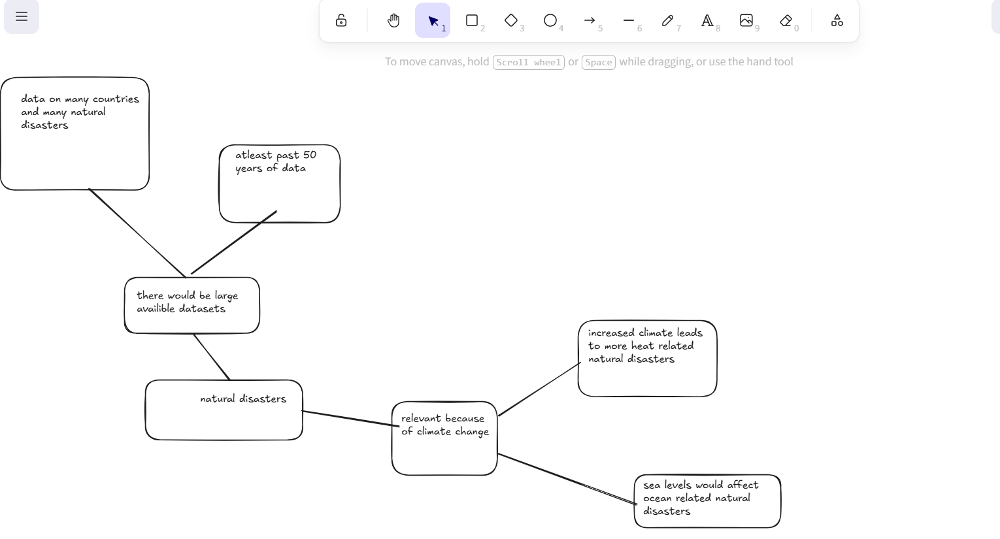

# EMERSON BELL ASSESMENT TASK 1

I believe that the planet is facing more natural disasters over the past 125 years, especially heat realted disasters such as bushfires and droughts.

I used public date from the emdat database https://public.emdat.be/data for my project

i plan to research to find the data and then i will shorten it if i only want some parts, such as if it has data that is not relevant to my hpyothesis.

## ANALYSIS

The visualisation shows that natural disasters have generally increased over time. Heat-related disasters such as bushfires and heatwaves became more common in recent decades. Countries with larger populations and extreme climates also appeared to experience higher disaster counts. 

## Conclusion

The data supported my hypothrsis that heat related disasters have increased over time and at a higher rate then others. Although this would be partially because of many disasters not being reported 100 years ago, I believe that the data still does show it in a correct way.

Plus: The program successfully searches and visualises disaster data using pandas and matplotlib.
Minus: Some graphs can become crowded and difficult to read with large amounts of data.
Implication: I could have tried to have the graphs in a different way, to help with this.